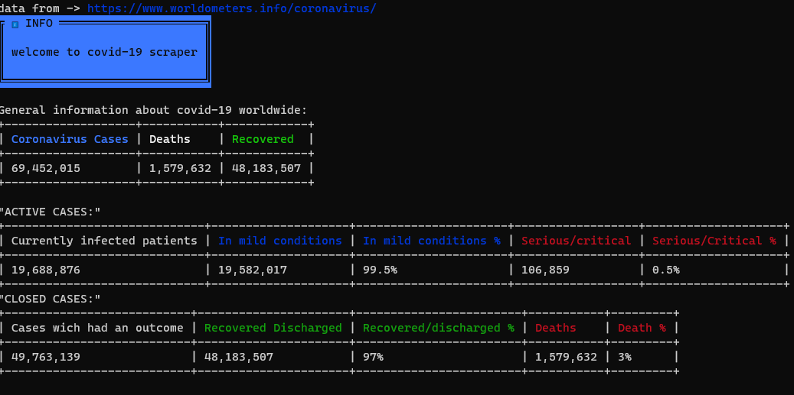
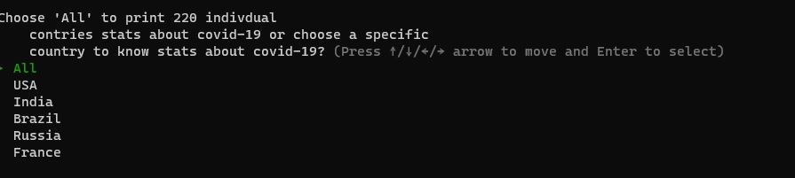

# Ruby Capstone Project

 
# covid-19-scraper

This app scrapes for data at [world ometers info](https://www.worldometers.info/coronavirus), presents general information in tables and allows the user to search statistics about covid-19 by country or territory.

I chose this theme as my Ruby capstone project because is a very interesting and common matter of conversation between me and my peers and it is changing the way we live our lives all around the world.

## To install and run

- Clone the project repo from [GitHub](https://github.com/helciodev/covid-19-scraper) using `git clone https://github.com/helciodev/covid-19-scraper`
- Make sure [Ruby-lang](https://www.ruby-lang.org/en/) is installed
- Make sure [Bundler](https://bundler.io/) is installed
- Install the required gems. Run `bundle install`
- Run `ruby bin/scraper.rb`

## Usage Instructions

As soon as the user starts running the app, he/she sees the information represented in the image above

The user can interact with the app by selecting a respective country from the 220 countries and territories affected by covid-19 using keyboard arrows as shown in the image below 

To run tests run `rspec spec/tests.rb`

## Designed With

- Gitflows
- Rubocop
- RSpec
- Colorize
- Nokogiri
- TTY
- VS-Code

## Contribute to this Project

Contributions, issues, and feature requests are welcome! Start by:

  - Forking the project
  - Cloning the project to your local machine
  - cd into the project directory
  - Run git checkout -b your-branch-name
  - Make your contributions
  - Push your branch up to your forked repository
  - Open a Pull Request with a detailed description of the development branch of the original project for a review

## Author

😎 **Helcio Andre**
- GitHub: [@helciodev](https://github.com/helciodev)
- Twitter: [@helcio_bruno](https://twitter.com/helcio_bruno)

## Show your support

Give a ⭐️ if you like this project!

